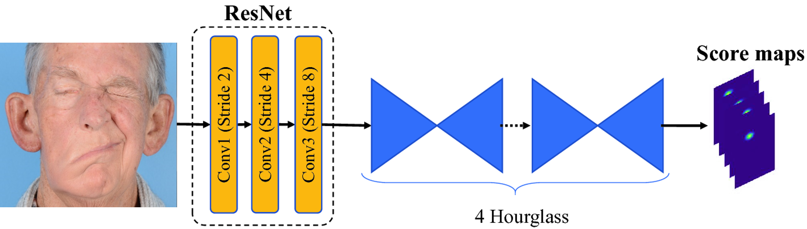

+++
# A Demo section created with the Blank widget.
# Any elements can be added in the body: https://sourcethemes.com/academic/docs/writing-markdown-latex/
# Add more sections by duplicating this file and customizing to your requirements.

widget = "blank"  # See https://sourcethemes.com/academic/docs/page-builder/
headless = true  # This file represents a page section.
active = true # Activate this widget? true/false
weight = 10  # Order that this section will appear.

title = ""
subtitle = ""

[design]
  # Choose how many columns the section has. Valid values: 1 or 2.
  columns = "1"

[design.background]
  # Apply a background color, gradient, or image.
  #   Uncomment (by removing `#`) an option to apply it.
  #   Choose a light or dark text color by setting `text_color_light`.
  #   Any HTML color name or Hex value is valid.

  # Background color.
  # color = "navy"
  
  # Background gradient.
  #gradient_start = "DarkGreen"
  #gradient_end = "ForestGreen"
  
  # Background image.
  #image = "fl_tech_background.jpg"  # Name of image in `static/img/`.
  #image_darken = 0.5  # Darken the image? Range 0-1 where 0 is transparent and 1 is opaque.
  #image_size = "cover"  #  Options are `cover` (default), `contain`, or `actual` size.
  # image_position = "center"  # Options include `left`, `center` (default), or `right`.
  #image_parallax = false  # Use a fun parallax-like fixed background effect? true/false
  
  # Text color (true=light or false=dark).
  text_color_light = false

[design.spacing]
  # Customize the section spacing. Order is top, right, bottom, left.
  padding = ["20px", "0px", "0px", "20px"]

[advanced]
 # Custom CSS. 
 css_style = ""
 
 # CSS class.
 css_class = ""
+++
### **Computer-vision based diagnosis of neurological diseases**

The way we move our face call say a lot about our overall health. Facial movements, such as smile of patients with neurological conditions, such as Parkinson's disease, Alzheimer's disease, stroke, and amyotrophic lateral sclerosis, are different from those of age-matched healthy controls. Thus, analysis of facial movements can be used to diagnose, assess, and monitor treatment effectiveness in multiple clinical populations.  

However, it is difficult to track how the face moves. Typically, specialized and expensive equipment, such as motion capture systems, is required to measure the movements of the face. 
Thus, this type of analysis is only performed in laboratory and research settings. 

The main objective of this project is to apply and improve recent facial analysis development based on **convolutional neural networks** to create a clinically valid tool for analysis of facial movements. Our lab will develop and validate an open-source, easy-to-use software application that patients can use to evaluate their disease status objectively. Clinicians can also use this application to monitor the treatment effect from the patient's home using a computer or mobile device. 

