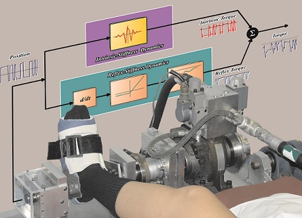

+++
# A Demo section created with the Blank widget.
# Any elements can be added in the body: https://sourcethemes.com/academic/docs/writing-markdown-latex/
# Add more sections by duplicating this file and customizing to your requirements.

widget = "blank"  # See https://sourcethemes.com/academic/docs/page-builder/
headless = true  # This file represents a page section.
active = true # Activate this widget? true/false
weight = 30  # Order that this section will appear.

title = ""
subtitle = ""

[design]
  # Choose how many columns the section has. Valid values: 1 or 2.
  columns = "1"

[design.background]
  # Apply a background color, gradient, or image.
  #   Uncomment (by removing `#`) an option to apply it.
  #   Choose a light or dark text color by setting `text_color_light`.
  #   Any HTML color name or Hex value is valid.

  # Background color.
  # color = "navy"
  
  # Background gradient.
  #gradient_start = "DarkGreen"
  #gradient_end = "ForestGreen"
  
  # Background image.
  #image = "fl_tech_background.jpg"  # Name of image in `static/img/`.
  #image_darken = 0.5  # Darken the image? Range 0-1 where 0 is transparent and 1 is opaque.
  #image_size = "cover"  #  Options are `cover` (default), `contain`, or `actual` size.
  # image_position = "center"  # Options include `left`, `center` (default), or `right`.
  #image_parallax = false  # Use a fun parallax-like fixed background effect? true/false
  
  # Text color (true=light or false=dark).
  text_color_light = false

[design.spacing]
  # Customize the section spacing. Order is top, right, bottom, left.
  padding = ["20px", "0px", "0px", "20px"]

[advanced]
 # Custom CSS. 
 css_style = ""
 
 # CSS class.
 css_class = ""
+++
### **Assessmen of neuromuscular properties**

Our joints define how we move and interact with the environment. These interactions often involve perturbations, such as stumbling, and joints must react to prevent damage, maintain balance, or preserve the movement trajectory. Voluntary reactions are not enough to prevent muscle damage or alteration joint trajectory produced by the perturbations, as they occur hundreds of milliseconds after the disturbance. Intrinsic and reflex stiffness are two additional, involuntary mechanisms that determine the instantaneous response of a joint to external perturbations. These mechanisms produce torques around the joint automatically in response to external perturbations. Thus, a comprehensive understanding of how the brain controls posture and movement must include a complete characterization of the joints’ intrinsic and reflex stiffness. 

Intrinsic and reflex stiffness act and change together and their contributions to the overall joint stiffness cannot be measured directly. Thus, advanced biomechanical models, robotic interfaces, and systems identification techniques must be used to describe the intrinsic and reflex stiffness.

The main objectives of this project are to:
* Develop and validate a robotic interface to perturb human joints. 
* Evaluate novel systems identification techniques to minimize data requirements and improve robustness against noise.

