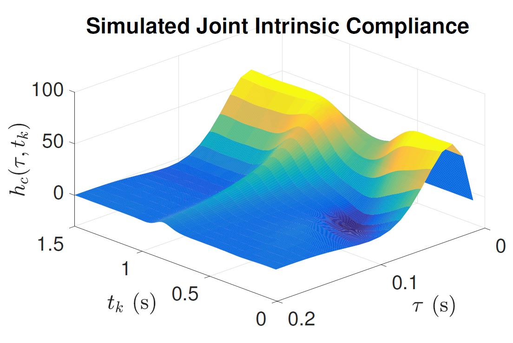

+++
# A Demo section created with the Blank widget.
# Any elements can be added in the body: https://sourcethemes.com/academic/docs/writing-markdown-latex/
# Add more sections by duplicating this file and customizing to your requirements.

widget = "blank"  # See https://sourcethemes.com/academic/docs/page-builder/
headless = true  # This file represents a page section.
active = true # Activate this widget? true/false
weight = 40  # Order that this section will appear.

title = ""
subtitle = ""

[design]
  # Choose how many columns the section has. Valid values: 1 or 2.
  columns = "1"

[design.background]
  # Apply a background color, gradient, or image.
  #   Uncomment (by removing `#`) an option to apply it.
  #   Choose a light or dark text color by setting `text_color_light`.
  #   Any HTML color name or Hex value is valid.

  # Background color.
  # color = "navy"
  
  # Background gradient.
  #gradient_start = "DarkGreen"
  #gradient_end = "ForestGreen"
  
  # Background image.
  #image = "fl_tech_background.jpg"  # Name of image in `static/img/`.
  #image_darken = 0.5  # Darken the image? Range 0-1 where 0 is transparent and 1 is opaque.
  #image_size = "cover"  #  Options are `cover` (default), `contain`, or `actual` size.
  # image_position = "center"  # Options include `left`, `center` (default), or `right`.
  #image_parallax = false  # Use a fun parallax-like fixed background effect? true/false
  
  # Text color (true=light or false=dark).
  text_color_light = false

[design.spacing]
  # Customize the section spacing. Order is top, right, bottom, left.
  padding = ["20px", "0px", "0px", "20px"]

[advanced]
 # Custom CSS. 
 css_style = ""
 
 # CSS class.
 css_class = ""
+++
### **Identification of nonlinear, time-varying systems**

Mathematical models are essential tools to describe and understand the behavior of physiological systems. Models provide a lot of information about the system under analysis and help to predict the effect of disease in the system function. 
Most physiological systems cannot be modeled successfully as linear systems. And their response is influenced by external or internal factors. For example, the force produced by a muscle does not change linearly with the neural input; there are a minimum and maximum force that the muscle can produce. Furthermore, factors such as muscle length, velocity, fatigue, and previous activation greatly influence the force that the muscle can produce at a given time. Thus, models of physiological systems must account for these propeties of the systems.

This project aims to develop and validate novel analytical and experimental approaches to identify mathematical models used to describe physiological systems. In particular, we are interested in models that describe the human neuromuscular system.

